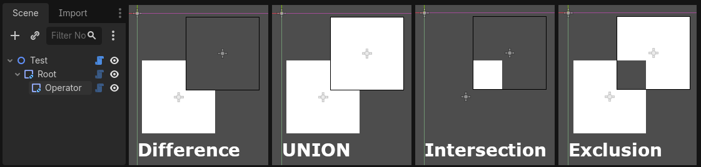

# J-CSG_2D

A Godot 4 addon that brings **2D Constructive Solid Geometry (CSG)** to your projects. Combine, subtract, intersect, and exclude 2D shapes using a node-based workflow similar to Godot's built-in 3D CSG nodes — but for 2D, along with a few extra features like partial draw, outlines, and hollow shapes.

## Installation
1. Copy the addons folder into your project.
2. In the Godot editor, go to Project → Project Settings → Plugins and enable **J-CSG_2D**.

## How it Works
Just like with the built in 3D CSG nodes, you can use any of these nodes as a "root" shape and add other shape nodes to it as children, which can apply a boolean operation to said root shape based on their operation variable.

**Notes:**
- You can have multiple operator nodes as children of one root node and they'll apply their operations in scene tree order.
- The baseclass for these nodes, `CSG_2D_Combiner`, doesn't have a shape inherently but can still be used as "root" node to combine multiple child shapes for organizational purposes.

### Baking Operation Results
While great for prototyping and certain niche use cases, these nodes are going to be way more CPU intensive than more static nodes. With that in mind, when any of the CSG nodes are selected a **Bake** button will appear in top toolbar of the 2D editor with the following options:
- **Bake Polygon Nodes** — Creates `Polygon2D` child nodes from the current shape output.
- **Bake Convex Collision** — Creates a `StaticBody2D` with `CollisionShape2D` nodes using `ConvexPolygonShape2D` from the current shape output.
- **Bake Concave Collision (Simple)** — Creates a `StaticBody2D` with `CollisionShape2D` nodes using `ConcavePolygonShape2D` (no holes) from the current shape output.
- **Bake Concave Collision (Complex)** — Creates a `StaticBody2D` with `CollisionPolygon2D` nodes (with holes) from the current shape output.

**Note:** The nodes do have a variable that allows them to have collisions generated from their shape at runtime if needed, but for production use it's generally recommended to bake the results into static nodes.

## Gizmos!
This plugin makes heavy use of another of my plugins, [J-Gizmos](https://github.com/Javlin-Joslin/J-Gizmos). If you have that plugin installed, you'll get some extra gizmos for editing the shapes of the nodes in the editor. If you don't have it installed, the nodes will still work just fine, but you'll have to edit their shape points manually in the inspector.

## License

See [LICENSE](LICENSE). - MIT License.

## Author

Christopher L. Joslin
